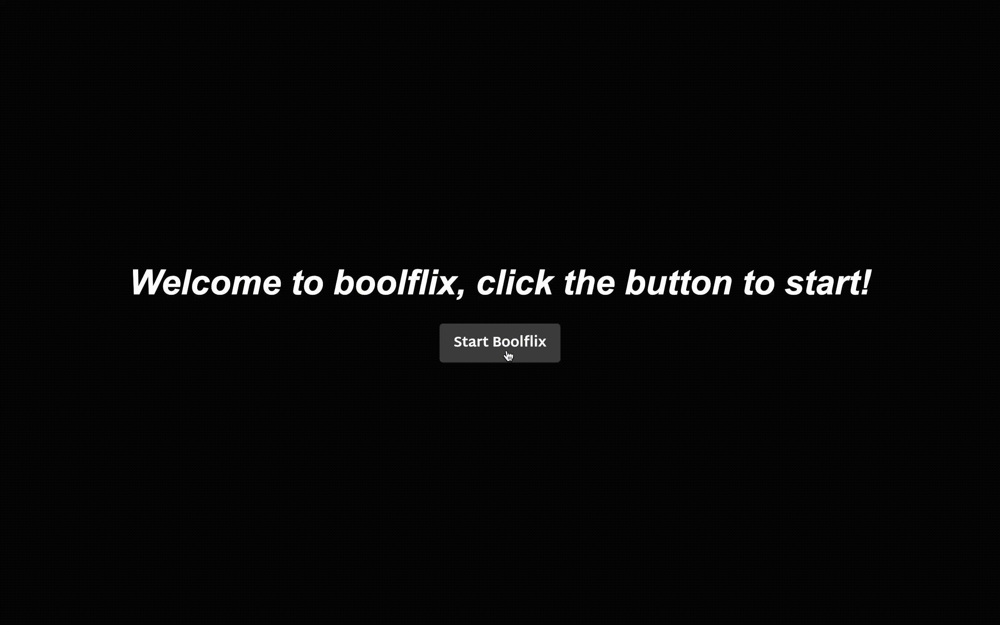
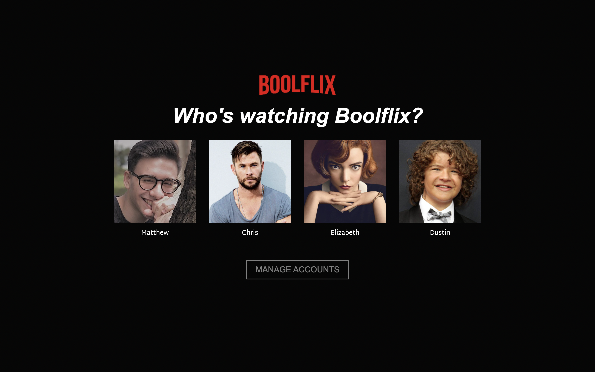

# Boolflix
Boolflix is a web app that aims to replicate the basic functions of Netflix using VueJS and TheMovieDb API

## Boolflix Start
You can start Boolflix by clicking on the start button as shown down here

## Boolflix Users
After Boolflix has started the user interface will be displayed to you, here you can choose a user to join Boolflix homepage

## Boolflix Home Page
After selecting a user you will join the Boolflix Home Page, here you can take a look at trending medias, tv series and movies

## Boolflix Medias
Flip a media card by hovering on it and take a look at the main infos about the movie! 
You can also watch the movie genres and the first 5 cast members of that movie by clicking on the "More" button

## Boolflix Search
You can also search a movie and filter the searched movies by genre as shown below

